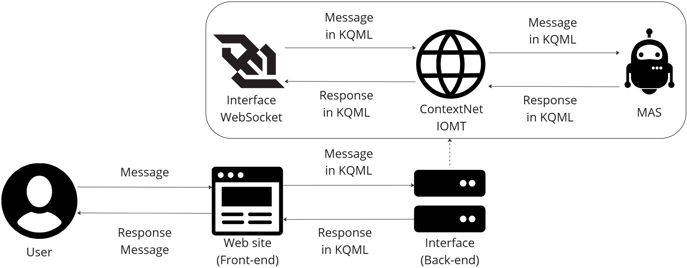

# ContextNet-api Gateway

Projeto de TCC para o curso de Sistemas de Informação. Esta aplicação Java, desenvolvida com Spring Boot, atua como uma ponte (gateway) entre uma aplicação web cliente (via WebSocket) e a rede ContextNet, permitindo o envio e recebimento de mensagens em tempo real.

## Objetivo

Permitir a comunicação entre um frontend web e a **ContextNet** (rede de middleware para IoT baseada em comunicação de nós), com foco no envio de comandos e recebimento de respostas por meio de mensagens padronizadas.

---

## Estrutura do Projeto

```
contextnetchat-api/
├── src/
│   └── main/
│       ├── java/
│       │   └── br/cefet/segaudit/
│       │       ├── service/
│       │       │   └── ContextNetClient.java
│       │       ├── dto/
│       │       │   └── ContextNetConfig.java
│       │       ├── factory/
│       │       │   └── ContextNetClientFactory.java
│       │       ├── controller/
│       │       │   └── ContextNetWebSocketHandler.java
│       │       ├── config/
│       │       │   └── WebSocketConfig.java
│       │       ├── Sender.java
│       └── resources/
│           └── application.properties
├── libs/
│   └── contextnet-2.7-patched.jar
├── pom.xml
└── README.md
```
---
## Arquitetura do Sistema



---

## Requisitos

- Java 17
- Maven 3.8+
- Spring Boot 3.2+
- Dependência ContextNet (`contextnet-2.7-patched.jar`) colocada manualmente em `libs/`

---

## Como rodar

1. **Clone o projeto**
   ```bash
   git clone https://github.com/seu-usuario/contextnet-encrypt.git
   cd contextnet-encrypt
   ```

2. **Garanta que o arquivo `contextnet-2.7-patched.jar` está presente**
   Coloque o JAR fornecido em `libs/contextnet-2.7-patched.jar`.  
   > O projeto depende dessa biblioteca e a inclui via `systemPath`.

3. **Compile e execute**
   ```bash
   mvn clean install
   mvn spring-boot:run
   ```

4. **WebSocket ativo**
   A aplicação abrirá o endpoint WebSocket na rota:
   ```
   ws://localhost:8080/ws
   ```
---

## Como funciona

1. O **cliente WebSocket** conecta-se ao servidor e envia um JSON com a configuração:

```json
{
  "gatewayIP": "192.168.0.100",
  "gatewayPort": 5500,
  "myUUID": "641f18ae-6c0c-45c2-972f-d37c309a9b72",
  "destinationUUID": "cc2528b7-fecc-43dd-a1c6-188546f0ccbf"
}
```

2. O servidor cria uma instância de `ContextNetClient`, que usa a classe `Sender` para se conectar ao gateway da **ContextNet** e enviar a mensagem de registro.

3. Após isso, o cliente pode enviar mensagens de texto pelo WebSocket, que são redirecionadas à ContextNet.

4. Respostas vindas da ContextNet são recebidas pela `Sender`, repassadas para o `ContextNetClient`, e depois reenviadas ao frontend via WebSocket.

---

## Principais Classes

| Classe                         | Função |
| -------------------------------|--------|
| `Sender`                       | Gerencia a conexão com a ContextNet via MRUDP. |
| `ContextNetClient`             | Faz a ponte entre a `Sender` e o WebSocket. |
| `ContextNetWebSocketHandler`   | Trata as conexões WebSocket, cria instâncias de `ContextNetClient`. |
| `ContextNetClientFactory`      | Cria clientes configurados com os dados enviados. |
| `ContextNetConfig`             | DTO que representa os dados necessários para conectar à ContextNet. |
| `WebSocketConfig`              | Configura o endpoint WebSocket no Spring. |

---

## Exemplo de mensagem ContextNet

```text
<mid1,641f18ae-6c0c-45c2-972f-d37c309a9b72,tell,cc2528b7-fecc-43dd-a1c6-188546f0ccbf,numeroDaSorte(3337)>
```

> Este formato segue a especificação esperada pela ContextNet (mid, remetente, tipo, destinatário, conteúdo).

---

## Referências

- [ContextNet (PUC-Rio)](https://gitlab.com/contextnet)
- Documentação interna da biblioteca `contextnet-2.7-patched.jar`

---

## Autor

**Gustavo Xavier Saldanha**  
**Mateus Façanha Lima de Souza**  
Projeto de Conclusão de Curso — Bacharelado em Sistemas de Informação  
CEFET/RJ - 2025

